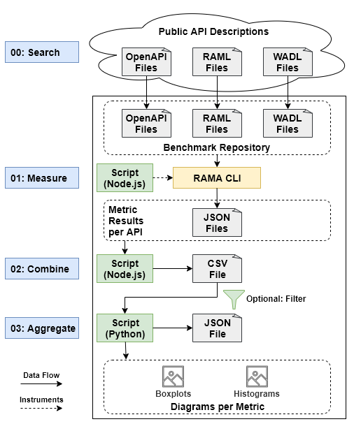

# RAMA CLI Threshold Benchmark
> A repeatable metric threshold derivation study with the [RAMA CLI](https://github.com/restful-ma/rama-cli)

## Purpose
This benchmark uses a large collection of publicly available API descriptions (OpenAPI, RAML, WADL) to calculate quartile-based metric threshold bands for all metrics of the [RAMA CLI](https://github.com/restful-ma/rama-cli). The used API files are located in the respective subfolders of `./benchmark-repository`.

## Prerequisites
- Install Node.js (>= v12.10.0)
- Install Python (>= v3.4.0)
- Install a JDK v8
- Install Maven
- Download and compile the [RAMA CLI](https://github.com/restful-ma/rama-cli)
  - This benchmark expects the JAR file to be at the following relative location: `../rama-cli/target/rama-cli-0.1.2.jar`
  - You can use the following helper script to automatically do this for you (requires Git): `download-and-build-rama-cli.sh`
- Install Node.js dependencies via `npm install`
- Install Python dependencies via `pip install -r requirements.txt`

## Threshold Bands

TODO: describe bands

## Benchmark Pipeline
The benchmark consists of four different steps. Every step except the first one (searching for APIs and creating the benchmark repository) is automated with a script.

The complete benchmark can be executed with the `./run-benchmark.sh` script. **CAVEAT:** This will delete the complete `./results` folder first and has a runtime of up to several hours (depending on your machine and whether you deleted APIs from `./benchmark-repository`).

Each step can also be executed manually by using the associated script. Simply run `node ./src/<scriptName>` for Node.js scripts and `python ./src/<scriptName>` for Python scripts.

- `00: Search` - Publicly available descriptions of RESTful APIs (OpenAPI v3, RAML v1.0, WADL) are collected and downloaded to the respective subfolder of `./benchmark-repository`. We mostly relied on keyword and file type search on GitHub and the repository from [APIs.guru](https://apis.guru/browse-apis). Identified Swagger / OpenAPI v2 files were automatically converted to OpenAPI v3 using the `./src/convert-openapi-v2.js` script.  **CAVEATS:** file names of APIs must NOT contain spaces. RAML files must all be renamed to `api.raml`.
- `01: Measure` - The RAMA CLI (see [Prerequisites](#prerequisites)) is used to collect the metric values for each API in `./benchmark-repository`. This is instrumented via the `/src/01-collect-metrics.js` script. This will create a JSON file with metrics per API in the respective format subfolder of `./results`.
- `02: Combine` - The metric results are combined into a single CSV file containing all measurements (`./results/metrics.csv`). This is achieved via the `./src/02-generate-csv.js` script.
- `03: Aggregate` - Measurements are aggregated and descriptive statistics for the threshold bands are calculated (`./results/aggregated-metrics.json`). Additionally, histograms and boxplots are created per metric (`./results/diagrams`). This is achieved with the `./src/03-aggregate-metrics.py` script. The script can also filter out specific API from the analysis. In our case, we only included APIs with at least 5 operations.
- Optional: You can also create a LaTex table with the descriptive statistics per metric (`./results/latex-tables.tex`) using the `./src/04-generate-latex.js` script.

## Current Benchmark Repository
The current repository contains 2,651 real-world API description files (2,619 OpenAPI, 18 WADL, and 14 RAML files). This sample is dominated by large cloud providers like Microsoft Azure (1,548 files), Google (305 files), or Amazon Web Services (205 files).
Additionally, there are cases where we have several files of different versions for the same API.
For the threshold derivations in `./src/03-aggregate-metrics.py`, we filter out APIs with less than five operations (*Weighted Service Interface Count* < 5) to avoid skewing the thresholds in favor of very small APIs.
This means that 914 APIs are not used in the `Aggregate` step.
Our benchmark run therefore calculated the quartile-based thresholds with a total of 1,737 APIs (1,708 OpenAPI, 16 WADL, and 13 RAML files).

We highly suggest to fine-tune the selected APIs to achieve more relevant thresholds for your context or API size.

## Threshold Results

TODO: add results table
